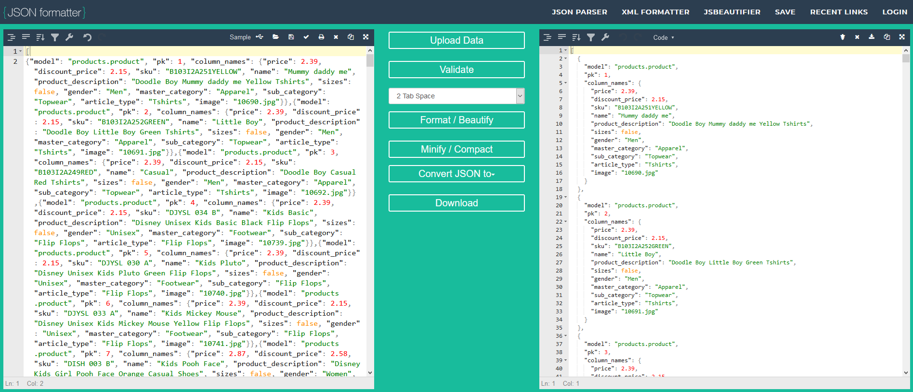

# Sportswear Online Fixtures JSON file Creation #


[Main README.md file](https://github.com/simonjvardy/Sportswear-Online/blob/main/README.md)


---

## Table of Contents ##

- [Introduction](#introduction)
- [products.json File creation](#products.json-file-creation)
  - [Curate the images](#curate-the-images)
  - [Create the products.json fixtures file](#create-the-products.json-fixtures-file)


---

## Introduction ##

The data set for this project was sourced from the [Fashion Product Image Dataset](https://www.kaggle.com/paramaggarwal/fashion-product-images-dataset) containing 44,440 (13.8GB) of image files along with 44,440 associated JSON files relating to each image containing highly detailed product information.

The images needed to be curated down to a manageable number for this project and only sportwear related images were selected.

---

## products.json File creation ##

### ***Curate the Images*** ##

The image files were manually sorted through and any suitable images of sportswear related clothing, footwear or accessories were copied into a separate folder. The images files were reduced from 44,400 down to 370 images.

A small python utility app ([move_files.py](utilities/move_files.py)) was written to read the curated image file names and then move the associated JSON files into a separate folder, ready for further work.

```Python
import shutil
import os

def move_listed_files():
    """
    Function to read the curated image filenames and extract the associated
    JSON files from the kaggle.com data set and move them to a new folder
    for further work.
    """

    src_images = r"D:\\FashionProductImageDataSet\\fashion-dataset\\curated_images\\"
    src_json = r"D:\\FashionProductImageDataSet\\fashion-dataset\\styles\\"
    dest = r"D:\\FashionProductImageDataSet\\fashion-dataset\\curated_json\\"

    files_count = 0

    for files in os.walk(src_images, topdown=False):
        for filename in files:

            image_filename = os.path.join(filename)
            str = image_filename.split('.')
            json_file = str[0] + '.json'
            full_json_filename = os.path.join(src_json, json_file)

            if os.path.isfile(full_json_filename):
                shutil.copy(full_json_filename, dest)
                files_count += 1

    print("Files copied:", files_count)


move_listed_files()

```


### ***Create the products.json Fixtures File*** ###

The source JSON files contained extremely detailed product information and was far more than required for this project.

However, they did contain all the required name value pairs needed for the Sportswear Online products model.

To extract only the required data from each of the 370 JSON source files, another Python utility app ([create_json.py](utilities/create_json.py)) was written to open and read all of the source JSON files from the local file directory and to loop through each one, extracting the required name value pairs, before appending the data to the products.json fixtures file.

```Python
import json
import os

json_path = r"D:\\FashionProductImageDataSet\\fashion-dataset\\curated_json\\"


def json_data(path):
    """
    Function to extract JSON file product data from kaggle.com data set
    to fit the Sportswear Online product model and fixtures JSON file format
    """
    pk = 1
    filelist = os.listdir(path)

    # write the data to a JSON file
    for i in filelist:
        if i.endswith(".json"):
            with open(path + i, "r") as f:
                json_data = json.load(f)

                """
                Source JSON file prices are in Indian Rupees
                Convert prices to GBP for the JSON output
                """
                price = json_data['data']['price']
                price_new = float("{:.2f}".format(price * 0.0096))

                """
                Convert prices to GBP for the JSON output and add an extra
                10% discount
                """
                discount_price = json_data['data']['discountedPrice']
                discount_price_new = float("{:.2f}".format(
                    (discount_price * 0.0096) * 0.90))

                default_special_offer = 1

                # Build the products JSON structure
                json_data = {
                    "model": "products.product",
                    "pk": pk,
                    "fields": {
                        "price": price_new,
                        "discount_price": discount_price_new,
                        "sku": json_data['data']['articleNumber'],
                        "name": json_data['data']['variantName'],
                        "product_description": json_data['data']['productDisplayName'],
                        "sizes": False,
                        "gender": json_data['data']['gender'],
                        "master_category": json_data['data']['masterCategory']['typeName'],
                        "sub_category": json_data['data']['subCategory']['typeName'],
                        "article_type": json_data['data']['articleType']['typeName'],
                        "special_offer": default_special_offer,
                        "image": str(json_data['data']['id']) + ".jpg",
                    }
                }

                # write the data to a JSON file
                with open('products.json', 'a') as json_file:
                    json.dump(json_data, json_file)

                pk += 1


json_data(json_path)

```


The source dataset was originally for an online store website based in India so the prices needed to have an exchange rate from Rupees to GBP applied as part of the data export.


Unfortunately, the output file data isn't in true JSON format so the full list of JSON objects was copied into [JSON Formatter](https://jsonformatter.org/) to use the "Repair JSON" and Format / Beautify functions on the JSON objects.




This formatted JSON data was copied back into [products.json](products/fixtures/products.json)

The products.json file was further manually editied to cleanse the data of any noticeable errors and to replace string values for integer foreign keys when the [master_category](products/fixtures/master_category.json), [sub_category](products/fixtures/sub_category.json), [gender](products/fixtures/gender.json) and [article_type](products/fixtures/article_type.json) Fixture files were created. 


Once the manual editing was completed and the data finalised, the development database tables were dumped back into json files ready for deployment to Heroku / PostgreSQL using the following commands in the Terminal:

```Python
python3 manage.py dumpdata --exclude auth.permission --exclude contenttypes --indent 2 > db.json
```

***Note: db.json file has NOT been saved to GiHub as it contains user information that may be personally identifiable, such as real names or email addresses. The 6 original Products Fixtures JSON files have been kept to allow a fully functioning database to be deployed and allow the developer to load a clean dataset in their own project.***


---

