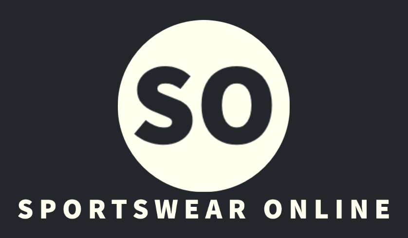
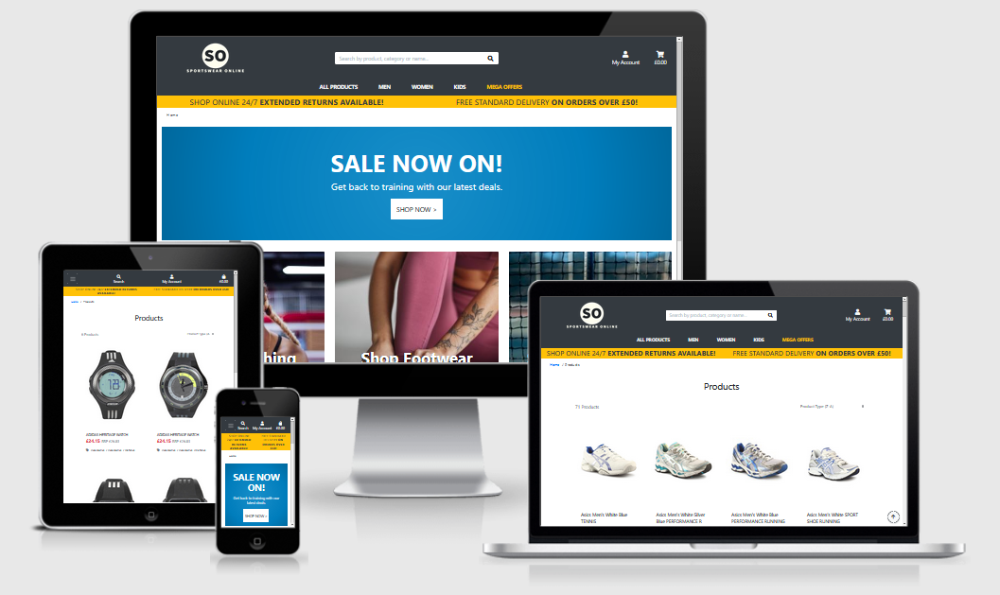
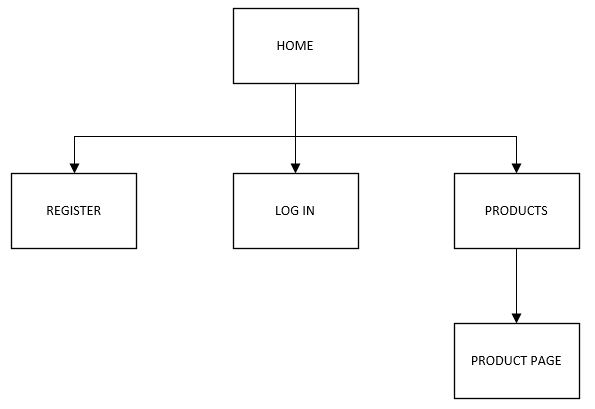
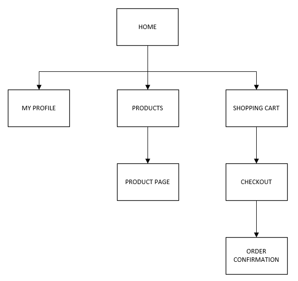
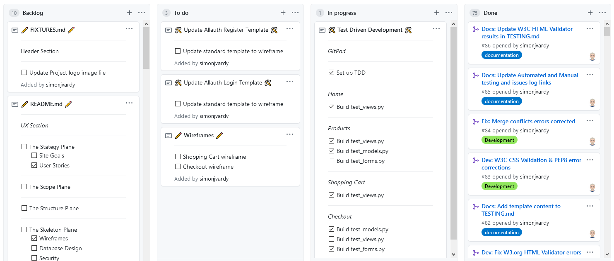

Sportswear Online is a (fictitious) online retailer providing sports clothing, footwear, equipment and accessories for sale. The idea for this final milestone project is to provide the visitor with a fully functioning, interactive e-commerce website providing easy, familiar navigation and allowing the simulated purchase of items from the store.

The site functionality will allow a common shopping experience for the visitor by providing a shopping cart to save chosen items, a secure checkout / payment facility and order confirmation using both on-screen messages and friendly, personalised emailed message.

***Please note: This site is purely for educational purposes only. The credit card payment facility is real but remains in test mode and so no payments will be taken. Please do not enter real credit card details when using this site.***



---

### **Contents** ###

- [UX Design](#ux-design)
  - [Project Goals](#project-goals)
  - [User Stories](#user-stories)
    - [Viewing and Navigation](#viewing-and-navigation)
    - [Registration and User Accounts](#registration-and-user-accounts)
    - [Sorting and Searching](#sorting-and-earching)
    - [Purchasing and Checkout](#purchasing-and-checkout)
    - [Admin and Store Management](#admin-and-store-management)
- [Design Choices](#Design-Choices)
  - [Colours](#Colours)
  - [Wireframes](#Wireframes)
- [Technologies](#technologies)
  - [Languages](#languages)
  - [Database](#database)
  - [Libraries](#libraries)
  - [Tools](#tools)
- [Features](#Features)
  - [Features Implemented](#Features-Implemented)
  - [Responsive Front-end Design](#Responsive-Front-end-Design)
  - [Back-end Design](#Back-end-Design)
    - [Fixtures JSON File creation](#Fixtures-JSON-File-creation)
  - [Site Construction](#Site-Construction)
    - [Topology](#Topology)
  - [Database Schema](#Database-Schema)
  - [CRUD Functionality](#CRUD-Functionality)
  - [Messages](#Messages)
  - [Defensive Programming](#Defensive-Programming)
  - [Additional Site Features](#Additional-Site-Features)
  - [Future Features](#Future-Features)
- [Project Management](#Project-Management)
- [Version Control](#Version-Control)
- [Testing](#Testing)
- [Bugs](#Bugs)
- [Deployment](#deployment)
  - [Cloning Sportswear Online from GitHub](#cloning-sportswear-online-from-github)
    - [Prerequisites](#prerequisites)
    - [Cloning the GitHub repository](#cloning-the-GitHub-repository)
    - [Creation of a Python Virtual Environment](#Creation-of-a-Python-Virtual-Environment)
    - [Install the App dependencies and external libraries](#Install-the-App-dependencies-and-external-libraries)
    - [Create the database in sqlite3](#Create-the-database-in-sqlite3)
    - [Create .env file](#Create-.env-file)
    - [Run the application locally](#Run-the-application-locally)
  - [Deploying Sportswear Online app to Heroku](#Deploying-Sportswear-Online-app-to-Heroku)
    - [Creating the Heroku app](#Creating-the-Heroku-app)
    - [Adding a PostgreSQL database to Heroku](#Adding-a-PostgreSQL-database-to-Heroku)
    - [Load the data into PostgreSQL](#Load-the-data-into-PostgreSQL)
    - [Push your repository to GitHub](#Push-you-repository-to-GitHub)
    - [Launch the app](#Launch-the-app)
- [Credits](#credits)
  - [Images](#images)
  - [Colour](#colour)
  - [Inspiration](#inspiration)
  - [Acknowledgements](#acknowledgements)


---

## **UX DESIGN** ##

### **Project Goals** ###

The **goal** of this project is to build a fully functioning e-commerce website, similar in design to popular UK high street retailers, allow the user to browse a range of sports related products. 


The **features** of the website will be:

- Search for products by type, name or category.
- Expanded menus displaying sub-categories of products to further filter the available products.
- Select items to purchase by size and quantity placed in a shopping cart.
- A checkout page where the items can be paid for with an integrated credit card payment facility.
- User registration with a profile page showing order history and delivery address.
- Order confirmation email functionality.

I achieve this by:

- Allowing purchases to be made whether the user is registered with an account or not.
- Providing a registration form with username and password for users to create an account.
- Providing a log in page for existing users to log in to their account.
- Utilising Stripe online payments infrastructure to enable purchasing of products
- Connecting Google Gmail to the website checkout functionality allowing order confirmation emails to be sent.

### **User Stories** ###

#### Viewing and Navigation ####

1. As a **shopper**, I want to be able to view a list of products so that I can choose some items to purchase.
2. As a **shopper**, I want to be able to filter products that I am interested in without searching through all the products.
3. As a **shopper**, I want to be able to select individual products to see more detailed information and add the item to my shopping cart.
4. As a **shopper**, I want to be able to see any product special offers, new arrivals and available deals, taking advantage of any reduced prices shown.
5. As a **shopper**, I want to be able to see items I have placed in my shopping cart easily so that I can keep track oof what I am buying
6. As a **shopper**, I want to be able to see breadcrumb navigation links to see where I am on the site easily.

#### Registration and User Accounts ####

7. As a **site user**, I want to be able to register for an account to make future purchases easier
8. As a **site user**, I want to be able to easily log in and out of my account so that I can access my personal account information
9. As a **site user**, I want to be able to receive and email requireing me to verify my email account to finish account registeration.
10. As a **site user**, I want to be able to log in and have a personal profile page containing my delivery details and order history
11. As a **site user**, I want to be able to save and update my delivery information on my personal profile page.

#### Sorting and Searching ####

12. As a **shopper**, I want to be able to sort the available products by price, main category, sub-category or product type
13. As a **shopper**, I want to be able to filter and group products for men, women, unisex or kids.
14. As a **shopper**, I want to be able to see how many products are available based on the sorting / filtering I have applied
15. As a **shopper**, I want to be able to search for a product by name, type or category.

#### Purchasing and Checkout ####

16. As a **shopper**, I want to be able to easily select the size and qualtity of a product when adding it to the shopping cart
17. As a **shopper**, I want to be able to view the items in my shopping cart waiting to be purchased, seeing the sub-total, delivery costs and grand total amounts.
18. As a **shopper**, I want to be able to easily update the items in the shopping cart by changing the quantities of products or remove them from the cart.
19. As a **shopper**, I want to be able to checkout securely where I can enter my delivery and credit card payment details with confidence.
20. As a **shopper**, I want to be able to view an order confirmation page as well as receive and email order confirmation once the transaction has succeeded.

#### Admin and Store Management ###

21. As a **store owner**, I want to be able to add new products to my store
22. As a **store owner**, I want to be able to edit / update the current product details and replace the product image file
23. As a **store owner**, I want to be able to delete a product that is no longer for sale.


[Back to contents](#contents)

---

## Design Choices ##


### **Colours** ###

I've chosen the colours mostly from the standard [Bootstrap Background Colours](https://getbootstrap.com/docs/4.0/utilities/colors/), applying classes to the template sections, as they conveniently fitted with the bold colours of the contemporary Sportwear Retailer sites this project site was modelled on:


- *bg-dark* (#343A40) - Gunmetal
- *bg-warning* (#FFC107) - Mikado Yellow
- *bg-success* (#28A745) - Green Pantone
- *Logo Text* (#FFFFF0) - Ivory
- *CTA Background Gradient 1* (#00689D) - Sapphire Blue
- *CTA Background Gradient 2* (#007DBC) - Star Command Blue
- *CTA Background Gradient 3* (#0082C3) - Green Blue Crayola


### **Wireframes** ###

I designed the site mock-ups using [Balsamiq wireframes](https://balsamiq.com/). I focussed on defining the basic layout structure of the site and identified how displays would change on different screen sizes such as mobile, tablet and desktop for each page.

- [Home Page](wireframes/home.png)
- [User Registration](wireframes/register.png)
- [User Log In](wireframes/login.png)
- [My Profile](wireframes/my-profile.png)
- [Products](wireframes/products.png)
- [Product Page](wireframes/product-page.png)
- [Product Management](wireframes/product-management.png)


---
## Technologies ##

### **Languages** ###

- [Python3](https://www.python.org/)
  - Used to create the main application functionality
- [HTML5](https://developer.mozilla.org/en-US/docs/Web/HTML)
  - Used as the main markup language for the website content.
- [CSS3](https://developer.mozilla.org/en-US/docs/Web/CSS)
  - Used to style the individual webpages.
- [JavaScript](https://developer.mozilla.org/en-US/docs/Web/JavaScript)
  - Used to create the interactive functionality of the website


### **Database** ###

- [PostgreSQL](https://www.postgresql.org/)
  - A powerful, open-source object-relational database.
- [sqlite3](https://www.sqlitetutorial.net/sqlite-python/)
  - Default database created with Django used for app development on localhost.

### **Libraries / Frameworks** ###

- [Bootstrap5](https://getbootstrap.com/)
  - Used to design a mobile-first responsive website layout.
- [Django](https://www.djangoproject.com/)
  - A high-level Python Web framework.
- [Django-Allauth](https://django-allauth.readthedocs.io/en/latest/overview.html)
  - Python user authentication and login plugin for Django.
- [Stripe](https://stripe.com/en-gb)
  - Online payments platform used for the shopping basket functionality.
- [Green Unicorn (gunicorn)](https://gunicorn.org/)
  - Python WSGI HTTP Server for Unix used on the Heroku deployment.
- [psycopg2-binary](https://pypi.org/project/psycopg2-binary/)
  - PostgreSQL database adapter for Python.
- [Pillow](https://pillow.readthedocs.io/en/stable/)
  - Python Image Library image processing capabilities.
- [sqlparse](https://pypi.org/project/sqlparse/)
  - sqlparse is a non-validating SQL parser for Python. It provides support for parsing, splitting and formatting SQL statements.
- [Boto3](https://boto3.amazonaws.com/v1/documentation/api/latest/index.html)
  - AWS SDK for Python (Boto3) used to create, configure, and manage AWS S3 services.
- [jQuery](https://jquery.com/)
  - Used for the initialisation of the Bootstrap5 components functionality and enhance the shopping bag functionality.
- [Django Template Language](https://docs.djangoproject.com/en/3.2/ref/templates/language/)
  - Templating language for Python.


### **Tools** ###

- [Git](https://git-scm.com/)
  - Git was used for version control by utilizing the Gitpod terminal to commit to Git and push to GitHub.
- [GitHub](https://github.com/)
  - Used to store, host and deploy the project files and source code after being pushed from Git.
- [Gitpod](https://www.gitpod.io/)
  - An online IDE linked to the GitHub repository used for the majority of the code development.
- [Font-Awesome](https://fontawesome.com/icons?d=gallery)
  - Used for icons to enhance headings and add emphasis to text.
- [Heroku](https://www.heroku.com)
  - Heroku is a platform as a service (PaaS) that enables developers to build, run, and operate applications entirely in the cloud.
- [AWS S3](https://aws.amazon.com/s3/)
  - Amazon Simple Storage Service (Amazon S3) is an object storage service used to store the site static files
- [JSON Formatter](https://jsonformatter.org/)
  - Online JSON Formatter, validator and conversion tool
- [Django Secret Key Generator](https://miniwebtool.com/django-secret-key-generator/)
  - The Django Secret Key Generator is used to generate a new SECRET_KEY for environment variables.
- [Adobe Lightroom](https://www.adobe.com/uk/products/photoshop-lightroom.html) 
  - For batch photo resizing and exporting for web
- [Adobe Spark](https://spark.adobe.com/sp)
  - Used to create the Sportswear Online logo
- [favicon.io](https://favicon.io/)
  - Used to create the website favicons
- [CSS Gradient Tool](https://cssgradient.io/)
  - Used to create the jumbotron radial gradient
- [Django Secret Key Generator](https://miniwebtool.com/django-secret-key-generator/)
  - Used to create the Django environment variables secret keys
- [dbdiagrams.io](https://dbdiagram.io/home)
  - Used to create the database entity-relationship diagram.


[Back to contents](#contents)

---

## Features ##


### **Features Implemented** ###

The following section describes the site design and page layouts to demonstrate the features implementsed.

### **Responsive Front-end Design** ###

- Responsive mobile first design using a Bootstrap v4.6 framework
- Django Template language is used to create the site's front-end dynamic content.

### **Back-end Design** ###

- The app is created using Python3 and Django framework to create an application structured using the Model-View-Controller (MVC) pattern.
- The site is deployed via a Heroku app linked to a GitHub repository.
- The dynamic content is served utilising a PostgreSQL relational database with static files and media stored on an AWS S3 bucket.


### **Site Construction** ##

#### Topology ####

- User Logged Out





- User Logged In





- Admin / Super User Logged In


### **User Story Features Implemented** ###

| User Story ID | Features Implemented |
| --- | --- |
| 1 | The Products page shows a full list of products with a product image, name, price and category labels. The products are displayed in a grid format with 4 columns on larger displays and reducing down to 1 column on mobile displays. |
| 2, 4 & 13 | The navbar allows users to filter the products by gender, category, sub-category and article type as well as special offers categories. The navbar menus are arranged to provide quick access to defined sorting criteria to assist the user to quickly find the types of products they want. |
| 3 | Each product image in the Products page can be clicked to open the item product page selected. The product page includes all the same information as the Products page but includes a quantity selector and a size selector (product category dependant), as well as allowing the user to return to the main products page or add the item to the shopping cart. |
| 5 & 17 | The user can click the shopping cart icon in the top right corner of the navbar to be taken to the cart page where each shopping cart item is listed with a product image, product details, unit price, quantity selector and a sub-total column. A toast message pop-up window appears each time the user adds an item to the shopping basket as a secondary way to easily keep track of the items to be purchased. Delivery cost and grand total amounts are also displayed on the shopping cart page. |
| 6 | The breadcrumbs navigation links are shown just below the delivery banner in the upper left corner of the main page block. They show the current page and provide navigation links back to the Home page or other related pages. |
| 7 & 9 | Users can click the My Account link in the navbar and select Register from the dropdown menu. The user is directed to the Sign-Up page where they must enter their email address, username and a password. An email is sent to the user to verify the account email address before registration is complete.  |
| 8 | Users can click the My Account link in the navbar and select Log In from the dropdown menu. The user is directed to the Log In page where they must enter their username and a password. Once logged in, users can click the My Account link in the navbar and select Logout from the dropdown menu.  |
| 10 & 11 | Users who are logged in can click the My Account link in the navbar and select My Profile from the dropdown menu. The user is directed to the My Profile page where they can see their saved delivery details and order history records. Users can update and save their details from the My Profile page.|
| 12 | A sorting selector is available on the Products page with a number of sorting options to list the products in both ascending and descending order. |
| 14 | The products page displays the total number of products returned by the search query |
| 15 | The navbar has a search box visible on larger displays or can be revealed when tapping the search icon on mobile displays. The user can search for a product by name, type or category. |
| 16 | Users can select the size (product category dependant) and the quantity from the individual product page when adding the item to the shopping cart. |
| 18 | Items in the shopping cart can have their individual quantities updated between 1 and 99 or remove the item if no longer needed. |
| 19 | Secure checkout and payment is provided by the integrated Stripe online credit card payment system. |
| 20 | Once an order is completed, the user is shown an order confirmation page detailing the oirder information, order details, delivery address and billing information. |
| 21 | Logged in store owners (admin / super users) have access to a Product Management page where new products can be added. |
| 22 & 23 | Logged in store owners (admin / super users) have access to edit and delete buttons for all products on the site. The edit button opens and edit product page where the store owner can update the product details. |


### **Database Schema** ###


#### **Fixtures JSON File creation** ####

- To enable the large amout of products data to be loaded easily into the database, fixtures JSON files were created to remove the manual work to build by hand each time via the site admin page.

- Utility apps were written in Python to sort through and extract information from the huge  [Fashion Product Images Dataset](https://www.kaggle.com/paramaggarwal/fashion-product-images-dataset) from www.kaggle.com

The full description of the fixtures JSON files creation process can be found in the [FIXTURES.md](https://github.com/simonjvardy/Sportswear-Online/blob/main/FIXTURES.md) document.

---

### **CRUD Functionality** ###


| Site Page | Create | Read | Update | Delete |
| --- | --- | --- | --- | --- |
| Products | | All Products | | |
| Products | | | | Delete Single Product |
| Product Page | | Single Product | | |
| Product Page | | | | Delete Single Product |
| Add Product | Add New Product | | | |
| Edit Product | | Single Product | | |
| Edit Product | | | Update Single Product | |
| Shopping Cart | | All Products | | |
| Shopping Cart | | | Update Product Quantity (Session) | |
| Shopping Cart | | | | Remove Product (Session) |
| Checkout | | All Products | | |
| Checkout | Create Order | | | |
| Checkout | Create Order Line Items | | | |
| Checkout | | User Delivery Details | | |
| Checkout | | | Update User Details | |
| Checkout | | | Update Product Quantity (Session) | |
| Checkout | | | | Remove Product (Session) |
| Sign Up | Add New User | | | |
| Log In | | User Details | | |
| Profile | | User Details | | |
| Profile | | User's Orders | | |
| Profile | | | Update Delivery Details | |


### **Messages** ###

- [Bootstrap Toasts](https://getbootstrap.com/docs/4.3/components/toasts/) are used with customised templates to show:
  - Errors - Django messages are displayed within the Toast body section with a red coloured top border of the header
  - Info - Django messages are displayed within the Toast body section with a teal coloured top border of the header
  - Success - Django messages are displayed within the Toast body section with a green coloured top border of the header
    - If the shopping cart grand total is greater than zero, the success toast also shows the user their current shopping cart contents with sub-total, delivery and grand total amounts.

### **Defensive Programming** ###

- In order to try to maintain the site security, defensive programming to prevent "brute force" loading of restricted pages was introduced.
  - At its simplest level, certain pages are removed from view unless a user is authenticated by being logged in or not.
  - Where appropriate, Python views functions are also modified by Django `@login_required` decorators to restrict user access to inappropriate pages.
  - Editing of products is restricted to super-users or admins using if...else conditions to check user authentication.


### **Additional Site Features** ###

- A set of friendly HTTP Error landing pages for site visitors to see if a requested page is unavailable or cannot be accessed.
  - The pages provide a message to the user and a button to click to return the visitor to the homepage.
  - HTTP 404, 500 & 503 errors are handled with custom templates to cover the most common events.

### **Future Features** ###

- Django Pagination to allow limiting the number of products per page to vastly improve the site performance while allowing full product inventory to be displayed across multiple pages.

- Account user registration using social media accounts such as Google, Facebook or LinkedIn.

- Additional tables for stock inventory control to create dynamic updates of the available sizes, stock quantities and In Stock / Out of Stock indicators.

- Discount codes functionality within the checkout app with a database table codes and validity from / to date ranges.


[Back to contents](#contents)


---


## Project Management ##

GitHub [Projects](https://github.com/simonjvardy/Sportswear-Online/projects) are used to organize the planning and development of the website.
Two GitHub projects are used to manage different aspects of the site development:
- [Development](https://github.com/simonjvardy/Sportswear-Online/projects/1)
  - Manages the project tasks and files.
- [Bug Fixes](https://github.com/simonjvardy/Sportswear-Online/projects/2)
  - Manages the triage and prioritization of the bug fixes.

The Projects are created using the following GitHub templates:
- `Automated kanban` template for the **Development** project.
- `Bug Triage` template for the **Bug Fixes** project.




[Back to contents](#contents)


---

## Version Control ##
**Version control** for this repository is managed within **GitHub** and **Gitpod** using separate [branches](https://github.com/simonjvardy/Sportswear-Online/branches)  used to work on specific aspects of the project.
The following describes the repository branch structure:
- **Main** - this is the default branch and the source for the repository deployment.
    - **Docs** - this branch is used for updating the README.md, FIXTURES.md and TESTING.md documentation.
    - **Development** - this branch is used as the main working branch for the website development.
    - **Features** - this branch is used to try out new ideas and enhancements for the website.
    - Each individual **bug fixes** are raised within their own **separate branches** using the naming convention **\<GitHub Issue ID Number>-\<bug fix description>** e.g. branch name ***12-correct-navbar-links*** 


[Back to contents](#contents)

---
## Testing ##

- Testing information can be found in a separate [TESTING.md](TESTING.md) file.


[Back to contents](#contents)

---
## Bugs ##

To manage bugs and issues tracking, the default GitHub [bug_report.md template](https://github.com/simonjvardy/Sportswear-Online/blob/main/.github/ISSUE_TEMPLATE/bug_report.md) has been created and activated within the repository settings Features > Issues section.
All new bugs and issues are tracked within the GitHub repository [Issues section](https://github.com/simonjvardy/Sportswear-Online/issues) .
Open issues are managed within the [GitHub Bug Fixes Project](https://github.com/simonjvardy/Sportswear-Online/projects/2)

Each branch is then **merged** into the **main branch** using a **pull request** that is **linked** to the **open issue**. Once merged, and the bug report **closed**, the branch is **deleted**.

Fixed bugs and issues are marked as closed. Full details of all closed issues can be viewed [here](https://github.com/simonjvardy/Sportswear-Online/issues?q=is%3Aissue+is%3Aclosed).


[Back to contents](#contents)

---

## Deployment ##

The website was developed using both Gitpod and Visual Studio Code and using Git pushed to GitHub, which hosts the repository. I made the following steps to deploy the site using Heroku:

### **Cloning Sportswear Online from GitHub** ###

#### **Prerequisites** ###

Ensure the following are installed locally on your computer:

- [Python 3.6 or higher](https://www.python.org/downloads/)
- [PIP3](https://pypi.org/project/pip/) Python package installer
- [Git](https://git-scm.com/) Version Control

*Please ensure you have an account created at [Stripe](https://stripe.com/gb) in order to use the online payment processing for the checkout app.*

#### **Cloning the GitHub repository** ####

- navigate to [simonjvardy/Sportswear-Online](https://github.com/simonjvardy/Sportswear-Online) GitHub repository.
- Click the **Code** button
- **Copy** the clone url in the dropdown menu
- Using your favourite IDE open up your preferred terminal.
- **Navigate** to your desired file location.

Copy the following code and input it into your terminal to clone Sportswear-Online:

```Python
git clone https://github.com/simonjvardy/Sportswear-Online.git
```


#### **Creation of a Python Virtual Environment** ####


*Note: The process may be different depending upon your own OS - please follow this [Python help guide](https://python.readthedocs.io/en/latest/library/venv.html) to understand how to create a virtual environment.*


#### **Install the App dependencies and external libraries** ####

- In your IDE terminal window, install the dependencies from the requirements.txt file with the following command:

```Python
pip3 install -r requirements.txt
```


#### **Create the database in sqlite3** ####

The installaton of the requirements.txt file will initialise the sqlite3 development database locally.

Run the following commands to create the database tables:

- Check there are no changes to the models already configured.

```Python
python3 manage.py makemigrations --dry-run
```

- Check which migrations will be applied.

```Python
python3 manage.py migrate --plan

```

- Apply the migrations.

```Python
python3 manage.py migrate
```

Load the fixtures files into the database in the following order:

```Python
python3 manage.py loaddata gender
python3 manage.py loaddata master_category
python3 manage.py loaddata sub_category
python3 manage.py loaddata article_type
python3 manage.py loaddata special_offer
python3 manage.py loaddata products
```

#### **Create .env file** ####

- Import and initialise environ in settings.py.
  - A helpful guide can be found [here](https://alicecampkin.medium.com/how-to-set-up-environment-variables-in-django-f3c4db78c55f)
- The .env file should contain at least the following information:

```Python
DEVELOPMENT=True
SECRET_KEY=[YOUR SECRET KEY]
STRIPE_PUBLIC_KEY=[YOUR STRIPE PUBLIC KEY]
STRIPE_SECRET_KEY=[YOUR STRIPE SECRET KEY]
STRIPE_WH_SECRET=[YOUR STRIPE WEBHOOK SECRET KEY]
```

- Please ensure you add in your own `SECRET_KEY`, `STRIPE_PUBLIC_KEY`, `STRIPE_SECRET_KEY`  and `STRIPE_WH_SECRET` values.
- The Stripe keys can be found in the Developers section under API Keys and Webhooks of your [Stripe Account](https://stripe.com/gb)
- ***Important:*** Add the `.env` file to your `.gitignore` file before pushing your files to any public git repository.


#### **Run the application locally** ####

- To run the application, enter the following command into the terminal window:

```Python
python3 manage.py runserver
```

### **Deploying Sportswear Online app to Heroku** ###

#### **Creating the Heroku app** ####

*Please ensure you have an account created at [Heroku](https://signup.heroku.com/login) in order to deploy the app.*

- Log in to your Heroku account dashboard and create a new app.
- Enter the App name.
  - This needs to be unique and sportswear-online is already in use so choose a suitable alternative name for your own App.
- Choose a geographical region closest to where you live.
  - Options available on a free account are ***United States*** or ***Europe***


#### **Adding a PostgreSQL database to Heroku** ####

- Select the **Resources** tab on your Heroku app dashboard
- Select `Heroku Postgres` as a new add-on with a Plan name of `Hobby Dev - Free`
- Heroku will build the PostgresQL database instance and add a config variable automatically.


#### **Load the data into PostgreSQL** ####

- Add the following variable to the `.env` file:
```Python
DATABASE_URL=[YOUR POSTGRESQL DATABASE URL FROM HEROKU CONFIG VARS]
```

- Apply the migrations to the Heroku PostgreSQl database tables.

```Python
python3 manage.py migrate
```

- Load the fixtures files into the PostgreSQL database in the following order:

```Python
python3 manage.py loaddata gender
python3 manage.py loaddata master_category
python3 manage.py loaddata sub_category
python3 manage.py loaddata article_type
python3 manage.py loaddata special_offer
python3 manage.py loaddata products
```

### **Push your repository to GitHub** ###
 - In the Heroku App Settings page, open the section Config Vars
 - Add all the environmant variables from your local `.env` file into the Heroku Config Vars:

| Key | Value |
| --- | --- |
| SECRET_KEY | [YOUR SECRET KEY] |
| STRIPE_PUBLIC_KEY | [YOUR STRIPE PUBLIC KEY] |
| STRIPE_SECRET_KEY | [YOUR STRIPE SECRET KEY] |
| STRIPE_WH_SECRET | [YOUR STRIPE WEBHOOK SECRET KEY] |
| DATABASE_URL | [YOUR POSTGRESQL DATABASE URL] |
| EMAIL_HOST_PASS | [YOUR GMAIL APP SIGN IN PASSWORD] |
| EMAIL_HOST_USER | [YOUR ORDER CONFIRMATION EMAIL ADDRESS FROM GMAIL]


- In the Heroku App Deploy page:
  - Select GitHub from the Deployment Method options.
  - Select Connect to GitHub.
  - Log in to your GitHub account from Heroku to link the App to GitHub.
  - Search for and select the repository to be linked in GitHub.
  - Select Connect.
  - Select Enable Automatic Deployment from the GitHub Master / Main branch.

#### **Launch the app** ####

- Click Open App in Heroku to launch the App in a new browser window.

***Note: The static files served from GitHub will be much slower to load than running locally. It is recommended to copy the static files to an online service such as an AWS S3 Bucket and connect this to Heroku.***


[Back to contents](#contents)

---


## Credits ##

### **Inspiration** ##

The following sportswear online retailers' websites were the basis for the design and layout ideas:

- [JD Sports](https://www.jdsports.co.uk/)
- [Sports Direct](https://www.sportsdirect.com/)
- [Decathlon](https://www.decathlon.co.uk/)
- [Greaves Sports ](https://www.greavessports.com/)
- [MA Sports](https://www.masports.co.uk/)
- [MandM Direct](https://www.mandmdirect.com/)

### **Images** ###

- [Fashion Product Images Dataset](https://www.kaggle.com/paramaggarwal/fashion-product-images-dataset) Credit: Param Aggarwal @ www.kaggle.com
  - The dataset consists of 44,440 images and associated individual JSON data files containing the product information.

- **Home Page**
  - All homepage images were source as free to use from Unsplash.com under their [license agreement](https://unsplash.com/license)
  - [Woman Boxer](https://unsplash.com/photos/tECL4qZgRi0) - Photo by [H.F.E & CO](https://unsplash.com/@happyfaceemoji?utm_source=unsplash&utm_medium=referral&utm_content=creditCopyText) on [Unsplash](https://unsplash.com/collections/827737/sport?utm_source=unsplash&utm_medium=referral&utm_content=creditCopyText)
  - [Woman tying shoelaces](https://unsplash.com/photos/whNiXtKGeWs) - Photo by [Cristina Anne Costello](https://unsplash.com/@lightupphotos?utm_source=unsplash&utm_medium=referral&utm_content=creditCopyText) on [Unsplash](https://unsplash.com/s/photos/tennis?utm_source=unsplash&utm_medium=referral&utm_content=creditCopyText)
  - [Tennis Racket, net, ball](https://unsplash.com/photos/POMeFvO3CwE) - Photo by [Cristina Anne Costello](https://unsplash.com/@lightupphotos?utm_source=unsplash&utm_medium=referral&utm_content=creditCopyText) on [Unsplash](https://unsplash.com/s/photos/tennis?utm_source=unsplash&utm_medium=referral&utm_content=creditCopyText)

### **Acknowledgements** ###

- [Code Institute](https://codeinstitute.net/full-stack-software-development-diploma/) Course material - in particular the Boutique Ado Django mini project
- [Simon Vardy](https://github.com/simonjvardy) for code snippets and README.md content.
- [Neringa Bickmore](https://github.com/neringabickmore/art-ial) art-ial GitHub repo for inspiration and README.md content ideas
- [Aukje van der Wal](https://github.com/byIlsa/story-chain) story-chain GitHub repo for inspiration and README.md content ideas
- [Daisy McGirr](https://github.com/Daisy-McG/ChatToTheMat) ChatToTheMat GitHub repo for inspiration and README.md content ideas
- [Stack Overflow](https://stackoverflow.com/)
  - [Limiting Floats to 2 decimal places](https://stackoverflow.com/questions/455612/limiting-floats-to-two-decimal-points)
  - [Writing json data to a file](https://stackoverflow.com/questions/12309269/how-do-i-write-json-data-to-a-file)
  - [Append data to a json file](https://stackoverflow.com/questions/12994442/how-to-append-data-to-a-json-file)
  - [Django test always returning code 301](https://stackoverflow.com/questions/21215035/django-test-always-returning-301)
  - [Python - List all the files in a directory](https://stackoverflow.com/questions/12199120/python-list-all-the-file-names-in-a-directory-and-its-subdirectories-and-then-p)
  - [Create a branch from another branch in git](https://stackoverflow.com/questions/4470523/create-a-branch-in-git-from-another-branch)
  - [JS count the number of occurrences of a character in a string](https://stackoverflow.com/questions/881085/count-the-number-of-occurrences-of-a-character-in-a-string-in-javascript)
  - [Django error: templatetag is not a registered tag library](https://stackoverflow.com/questions/40686201/django-1-10-1-my-templatetag-is-not-a-registered-tag-library-must-be-one-of)
- [dev.to](https://dev.to/gajesh/the-complete-django-allauth-guide-la3) Django Allauth configuration tutorial
- [Django Documentation](https://docs.djangoproject.com/en/3.2/)
  - [Models: Options](https://docs.djangoproject.com/en/3.1/ref/models/options/)
  - [Loading initial data fixtures](https://docs.djangoproject.com/en/dev/howto/initial-data/#automatically-loading-initial-data-fixtures)
  - [Contrib: Admin](https://docs.djangoproject.com/en/3.2/ref/contrib/admin/)
- [Kite](https://www.kite.com/python/answers/how-to-loop-through-all-nested-dictionary-values-using-a-for-loop-in-python
) How to loop through all nested dictionary values using a for loop in Python
- [W3Schools](https://www.w3schools.com/howto/howto_css_hide_arrow_number.asp) How to hide number field arrows with CSS
- [Bootstrap v4.6](https://getbootstrap.com/docs/4.6/getting-started/introduction/) Documentation and code snippets used to build most of the templates
- [Coderwall](https://coderwall.com/p/mvsoyg/django-dumpdata-and-loaddata) How to use Django dumpdata and loaddata
- [Stack Abuse](https://stackabuse.com/reading-and-writing-json-to-a-file-in-python/) Reading and writing json to a file in Python.