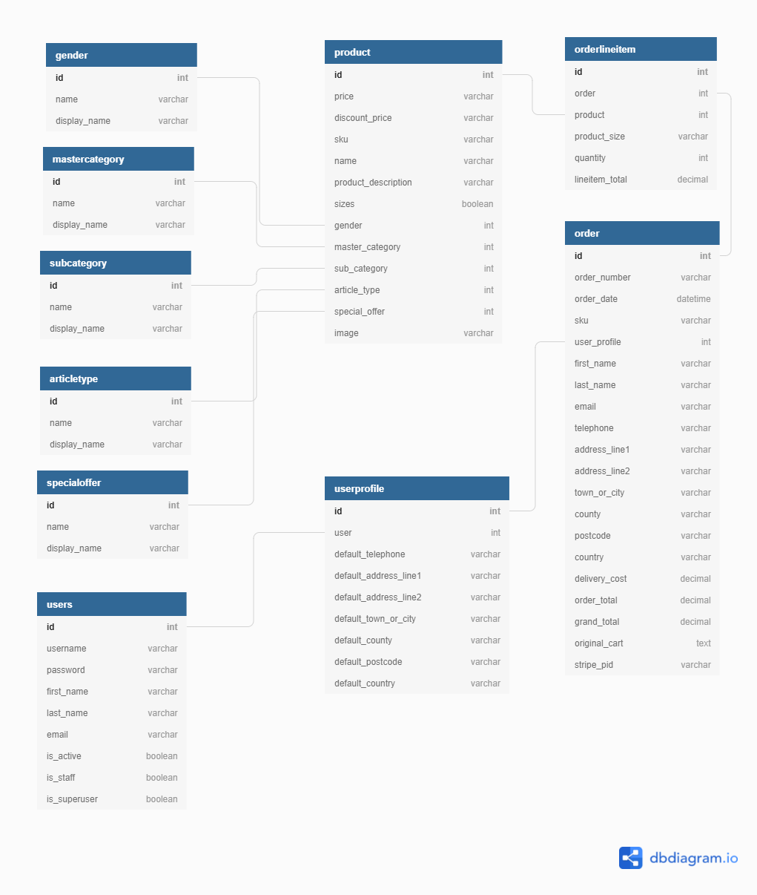
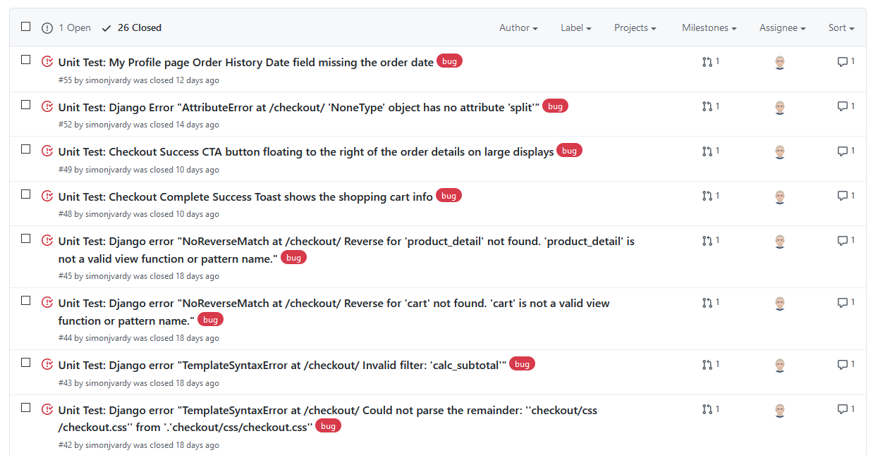
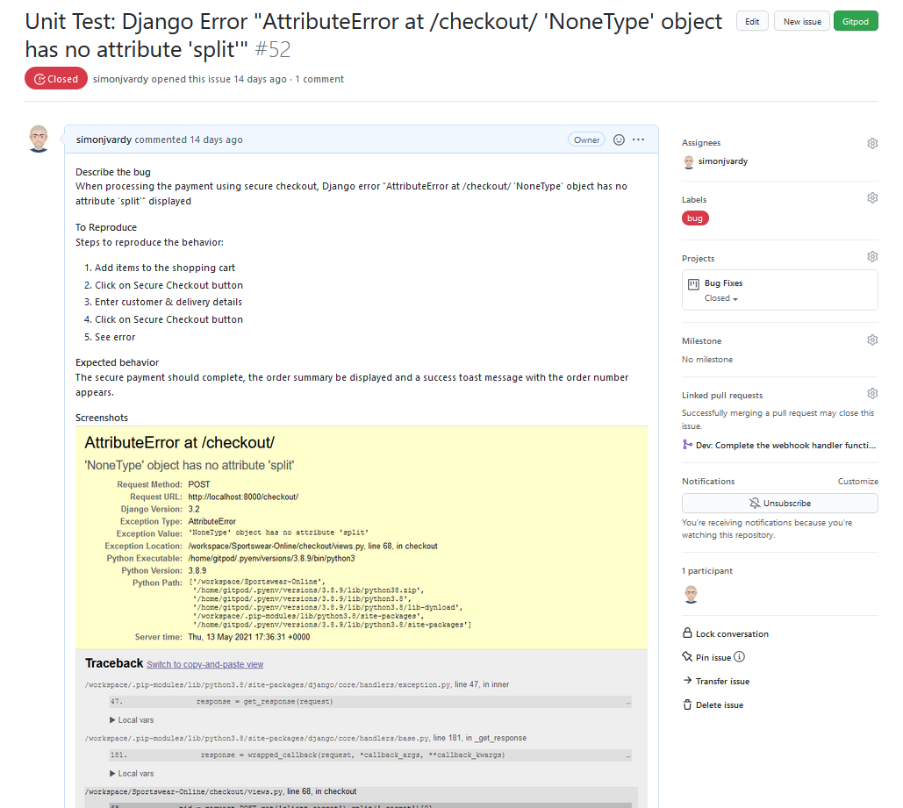

Sportswear Online is a (fictitious) online retailer providing sports clothing, footwear, equipment and accessories for sale. The ideas for this final milestone project is to provide the visitor with a fully functioning, interactive e-commerce website providing easy, familiar navigation and allowing the simulated purchase of items from the store.

The site functionality will allow a common shopping experience for the visitor by providing a shopping cart to save chosen items, a secure checkout / payment facility and order confirmation using both on-screen messages and friendly, personalised emailed message.

***Please note: This site is purely for educational purposes only. The credit card payment facility is real but remains in test mode and so no payments will actually be taken. Please do not enter real credit card details when using this site.***

---

### **Contents** ###

- [UX (User Experience)](#ux-user-experience)
  - [Project Goals](#project-goals)
  - [User Goals](#user-goals)
  - [User Stories](#user-stories)
  - [Site Owner Goals](#site-owner-goals)
- [Technologies](#technologies)
  - [Languages](#languages)
  - [Database](#database)
  - [Libraries](#libraries)
  - [Tools](#tools)
- [Credits](#credits)
  - [Images](#images)
  - [Colour](#colour)
  - [Inspiration](#inspiration)
  - [Acknowledgements](#acknowledgements)

---

## **UX DESIGN** ##

### **Project Goals** ###

The **goal** of this project is to build a fully functioning e-commerce website, similar in design to popular UK high street retailers, allow the user to browse a range of sports related products. 

The **features** of the website will be:

- Search for products by type, name or category.
- Expanded menus displaying sub-categories of products to further filter the available products.
- Select items to purchase by size and quantity placed in a shopping cart.
- A checkout page where the items can be paid for with an integrated credit card payment facility.
- User registration with a profile page showing order history and delivery address.
- Order confirmation email functionality.

I achieve this by:

- Allowing purchases to be made whether the user is registered with an account or not.
- Providing a registration form with username and password for users to create an account.
- Providing a log in page for existing users to log in to their account.
- Utilising Stripe online payments infrastructure to enable purchasing of products
- Connecting Google Gmail to the website checkout functionality allowing order confirmation emails to be sent.

### **User Stories** ###

#### Viewing and Navigation ####

1. As a **shopper**, I want to be able to view a list of products so that I can choose some items to purchase.
2. As a **shopper**, I want to be able to filter products that I am interested in without searching through all the products.
3. As a **shopper**, I want to be able to select individual products to see more detailed information and add the item to my shopping cart.
4. As a **shopper**, I want to be able to see any product special offers, new arrivals and available deals, taking advantage of any reduced prices shown.
5. As a **shopper**, I want to be able to see items I've placed in my shopping cart easily so that I can keep track oof what I am buying
6. As a **shopper**, I want to be able to see breadcrumb navigation links to see where I am on the site easily.

#### Registration & User Accounts ####

7. As a **site user**, I want to be able to register for an account to make future purchases easier
8. As a **site user**, I want to be able to easily log in and out of my account so that I can access my personal account information
9. As a **site user**, I want to be able to receive and email requireing me to verify my email account to finish account registeration.
10. As a **site user**, I want to be able to log in and have a personal profile page containing my delivery details and order history
11. As a **site user**, I want to be able to save and update my delivery information on my personal profile page.

#### Sorting & Searching ####

12. As a **shopper**, I want to be able to sort the available products by price, main category, sub-category or product type
13. As a **shopper**, I want to be able to filter and group products for men, women, unisex or kids.
14. As a **shopper**, I want to be able to see how many products are available based on the sorting / filtering I have applied
15. As a **shopper**, I want to be able to search for a product by name, type or category.

#### Purchasing & Checkout ####

16. As a **shopper**, I want to be able to easily select the size and qualtity of a product when adding it to the shopping cart
17. As a **shopper**, I want to be able to view the items in my shopping cart waiting to be purchased, seeing the sub-total, delivery costs and grand total amounts.
18. As a **shopper**, I want to be able to easily update the items in the shopping cart by changing the quantities of products or remove them from the cart.
19. As a **shopper**, I want to be able to checkout securely where I can enter my delivery and credit card payment details with confidence.
20. As a **shopper**, I want to be able to view an order confirmation page as well as receive and email order confirmation once the transaction has succeeded.

#### Admin & Store Management ###

21. As a **store owner**, I want to be able to add new products to my store
22. As a **store owner**, I want to be able to edit / update the current product details and replace the product image file
23. As a **store owner**, I want to be able to delete a product that is no longer for sale.

[Back to contents](#contents)

## The Scope Plane ##

### Site Features ###

---

## The Structure Plane ##

---

## The Skeleton Plane ##

### Wireframes ###

### Database Schema ###

---

## Features ##

### **Features Implemented** ###

### **CRUD Functionality** ###

| Site Page | Create | Read | Update | Delete |
| --- | --- | --- | --- | --- |

### **Defensive Programming** ###

[Back to contents](#contents)

---
## Technologies ##

### **Languages** ###

- [Python3](https://www.python.org/)
  - Used to create the main application functionality
- [HTML5](https://developer.mozilla.org/en-US/docs/Web/HTML)
  - Used as the main markup language for the website content.
- [CSS3](https://developer.mozilla.org/en-US/docs/Web/CSS)
  - Used to style the individual webpages.
- [JavaScript](https://developer.mozilla.org/en-US/docs/Web/JavaScript)
  - Used to create the interactive functionality of the website

### **Database** ###

- [PostgreSQL](https://www.postgresql.org/)
  - A powerful, open source object-relational database.
- [sqlite3](https://www.sqlitetutorial.net/sqlite-python/)
  - Default database created with Django used for app development on localhost.

### **Libraries / Frameworks** ###

- [Bootstrap5](https://getbootstrap.com/)
  - Used to design a mobile-first responsive website layout.
- [Django](https://www.djangoproject.com/)
  - A high-level Python Web framework.
- [Django-Allauth](https://django-allauth.readthedocs.io/en/latest/overview.html)
  - Python user authentication and login plugin for Django.
- [Stripe](https://stripe.com/en-gb)
  - Online payments platform used for the shopping basket functionality.
- [Green Unicorn (gunicorn)](https://gunicorn.org/)
  - Python WSGI HTTP Server for Unix used on the Heroku deployment.
- [psycopg2-binary](https://pypi.org/project/psycopg2-binary/)
  - PostgreSQL database adapter for Python.
- [Pillow](https://pillow.readthedocs.io/en/stable/)
  - Python Image Library image processing capabilities.
- [sqlparse](https://pypi.org/project/sqlparse/)
  - sqlparse is a non-validating SQL parser for Python. It provides support for parsing, splitting and formatting SQL statements.
- [Boto3](https://boto3.amazonaws.com/v1/documentation/api/latest/index.html)
  - AWS SDK for Python (Boto3) used to create, configure, and manage AWS S3 services.
- [jQuery](https://jquery.com/)
  - Used for the initialisation of the Bootstrap5 components functionality and enhance the shopping bag functionality.
- [Jinja](https://jinja.palletsprojects.com/en/2.11.x/)
  - Templating language for Python.

### **Tools** ###

- [Git](https://git-scm.com/)
  - Git was used for version control by utilizing the Gitpod terminal to commit to Git and push to GitHub.
- [GitHub](https://github.com/)
  - Used to store, host and deploy the project files and source code after being pushed from Git.
- [Gitpod](https://www.gitpod.io/)
  - An online IDE linked to the GitHub repository used for the majority of the code development.
- [Font-Awesome](https://fontawesome.com/icons?d=gallery)
  - Used for icons to enhance headings and add emphasis to text.
- [Heroku](https://www.heroku.com)
  - Heroku is a platform as a service (PaaS) that enables developers to build, run, and operate applications entirely in the cloud.
- [AWS S3](https://aws.amazon.com/s3/)
  - Amazon Simple Storage Service (Amazon S3) is an object storage service used to store the site static files
- [JSON Formatter](https://jsonformatter.org/)
  - Online JSON Formatter, validator and conversion tool
- [Django Secret Key Generator](https://miniwebtool.com/django-secret-key-generator/)
  - The Django Secret Key Generator is used to generate a new SECRET_KEY for environment variables.
- [Adobe Lightroom](https://www.adobe.com/uk/products/photoshop-lightroom.html) 
  - For batch photo resizing and exporting for web
- [Adobe Spark](https://spark.adobe.com/sp)
  - Used to create the Sportswear Online logo
- [favicon.io](https://favicon.io/)
  - Used to create the website favicons
- [CSS Gradient Tool](https://cssgradient.io/)
  - Used to create the jumbotron radial gradient
- [Django Secret Key Generator](https://miniwebtool.com/django-secret-key-generator/)
  - Used to greate the Django environment variables secret keys
- [dbdiagrams.io](https://dbdiagram.io/home)
  - Used to create the database entity-relationship diagram.

[Back to contents](#contents)

---

## Project Management ##

GitHub [Projects](https://github.com/simonjvardy/Sportswear-Online/projects) are used to organize the planning and development of the website.
Two GitHub projects are used to manage different aspects of the site development:
- [Development](https://github.com/simonjvardy/Sportswear-Online/projects/1)
  - Manages the project tasks and files.
- [Bug Fixes](https://github.com/simonjvardy/Sportswear-Online/projects/2)
  - Manages the triage and prioritization of the bug fixes.

The Projects are created using the following GitHub templates:
- `Automated kanban` template for the **Development** project.
- `Bug Triage` template for the **Bug Fixes** project.

[Back to contents](#contents)

---

## Version Control ##
**Version control** for this repository is managed within **GitHub** and **Gitpod** using separate [branches](https://github.com/simonjvardy/Sportswear-Online/branches)  used to work on specific aspects of the project.
The following describes the repository branch structure:
- **Main** - this is the default branch and the source for the repository deployment.
    - **Docs** - this branch is used for updating the README.md and testing.md documentation only.
    - **Development** - this branch is used as the main working branch for the website development.
    - **Features** - this branch is used to try out new ideas and enhancements for the website.
        - Features and enhancements that are accepted are merged down into the Development branch.
    - Each individual **bug fixes** are raised within their own **separate branches** using the naming convention **\<GitHub Issue ID Number>-\<bug fix description>** e.g. branch name ***12-correct-navbar-links*** 

[Back to contents](#contents)

---
## Testing ##

- Testing information can be found in a separate [TESTING.md](TESTING.md) file.

[Back to contents](#contents)

---
## Bugs ##

To manage bugs and issues tracking, the default GitHub [bug_report.md template](https://github.com/simonjvardy/Sportswear-Online/blob/main/.github/ISSUE_TEMPLATE/bug_report.md) has been created and activated within the repository settings Features > Issues section.
All new bugs and issues are tracked within the GitHub repository [Issues section](https://github.com/simonjvardy/Sportswear-Online/issues) .
Open issues are managed within the [GitHub Bug Fixes Project](https://github.com/simonjvardy/Sportswear-Online/projects/2)

Each branch is then **merged** into the **main branch** using a **pull request** that is **linked** to the **open issue**. Once merged, and the bug report **closed**, the branch is **deleted**.

Fixed bugs and issues are marked as closed. Full details of all closed issues can be viewed [here](https://github.com/simonjvardy/Sportswear-Online/issues?q=is%3Aissue+is%3Aclosed).

[Back to contents](#contents)

---

## Deployment ##

---

## Credits ##

### **Inspiration** ##

The following sportswear online retailers' websites were the basis for the design and layout ideas:

- [JD Sports](https://www.jdsports.co.uk/)
- [Sports Direct](https://www.sportsdirect.com/)
- [Decathlon](https://www.decathlon.co.uk/)
- [Greaves Sports ](https://www.greavessports.com/)
- [MA Sports](https://www.masports.co.uk/)
- [MandM Direct](https://www.mandmdirect.com/)

### **Images** ###

- [Fashion Product Images Dataset](https://www.kaggle.com/paramaggarwal/fashion-product-images-dataset) Credit: Param Aggarwal @ www.kaggle.com
  - The dataset consists of 44,440 images and associated individual JSON data files containing the product information.

### **Acknowledgements** ###

- [Code Institute](https://codeinstitute.net/full-stack-software-development-diploma/) Course material - in particular the Boutique Ado Django mini project
- [Simon Vardy](https://github.com/simonjvardy) for code snippets and README.md content.
- [Neringa Bickmore](https://github.com/neringabickmore/art-ial) art-ial GitHub repo for inspiration and README.md content ideas
- [Aukje van der Wal](https://github.com/byIlsa/story-chain) story-chain GitHub repo for inspiration and README.md content ideas
- [Daisy McGirr](https://github.com/Daisy-McG/ChatToTheMat) ChatToTheMat GitHub repo for inspiration and README.md content ideas
- [Stack Overflow](https://stackoverflow.com/)
  - [Limiting Floats to 2 decimal places](https://stackoverflow.com/questions/455612/limiting-floats-to-two-decimal-points)
  - [Writing json data to a file](https://stackoverflow.com/questions/12309269/how-do-i-write-json-data-to-a-file)
  - [Append data to a json file](https://stackoverflow.com/questions/12994442/how-to-append-data-to-a-json-file)
  - [Django test always returning code 301](https://stackoverflow.com/questions/21215035/django-test-always-returning-301)
  - [Python - List all the files in a directory](https://stackoverflow.com/questions/12199120/python-list-all-the-file-names-in-a-directory-and-its-subdirectories-and-then-p)
  - [Create a branch from another branch in git](https://stackoverflow.com/questions/4470523/create-a-branch-in-git-from-another-branch)
  - [JS count the number of occurrences of a character in a string](https://stackoverflow.com/questions/881085/count-the-number-of-occurrences-of-a-character-in-a-string-in-javascript)
  - [Django error: templatetag is not a registered tag library](https://stackoverflow.com/questions/40686201/django-1-10-1-my-templatetag-is-not-a-registered-tag-library-must-be-one-of)
- [dev.to](https://dev.to/gajesh/the-complete-django-allauth-guide-la3) Django Allauth configuration tutorial
- [Django Documentation](https://docs.djangoproject.com/en/3.2/)
  - [Models: Options](https://docs.djangoproject.com/en/3.1/ref/models/options/)
  - [Loading initial data fixtures](https://docs.djangoproject.com/en/dev/howto/initial-data/#automatically-loading-initial-data-fixtures)
  - [Contrib: Admin](https://docs.djangoproject.com/en/3.2/ref/contrib/admin/)
- [Kite](https://www.kite.com/python/answers/how-to-loop-through-all-nested-dictionary-values-using-a-for-loop-in-python
) How to loop through all nested dictionary values using a for loop in Python
- [W3Schools](https://www.w3schools.com/howto/howto_css_hide_arrow_number.asp) How to hide number field arrows with CSS
- [Bootstrap v4.6](https://getbootstrap.com/docs/4.6/getting-started/introduction/) Documentation and code snippets used to build the majority of the templates
- [Coderwall](https://coderwall.com/p/mvsoyg/django-dumpdata-and-loaddata) How to use Django dumpdata and loaddata
- [Stack Abuse](https://stackabuse.com/reading-and-writing-json-to-a-file-in-python/) Reading & writing json to a file in Python.