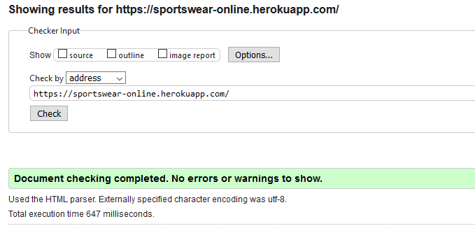
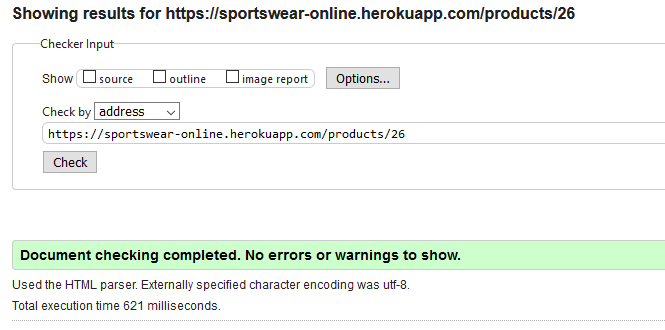
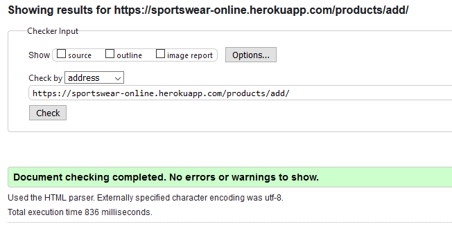
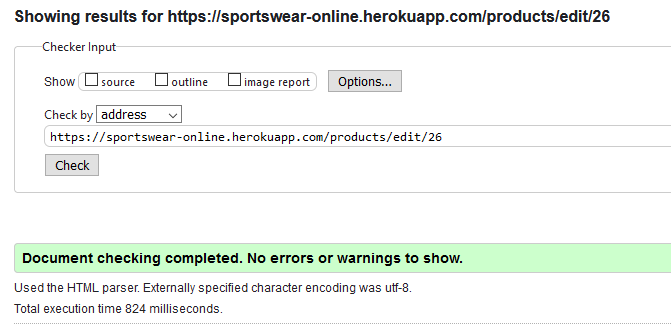
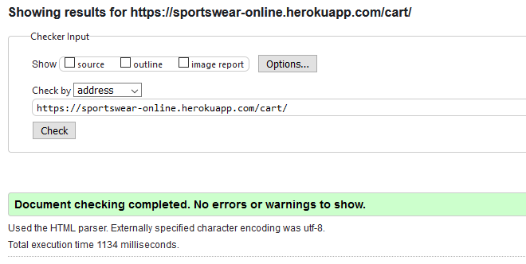
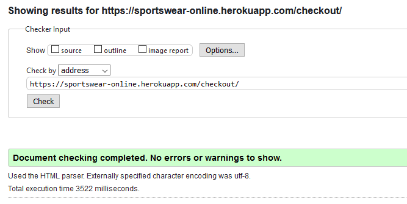
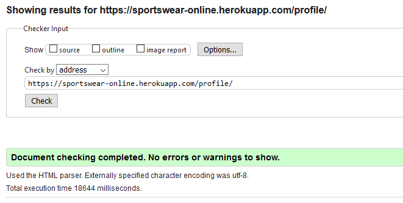
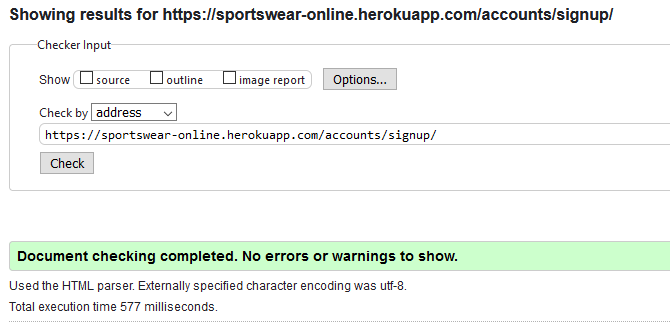
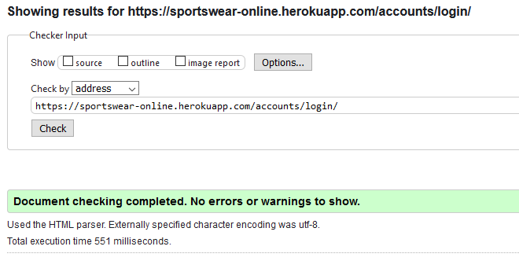

# Sportswear Online Project Testing Details #


[Main README.md file](https://github.com/simonjvardy/Sportswear-Online/blob/main/README.md)

[View the live project here.](http://sportswear-online.herokuapp.com/)

---

## Table of Contents ##

- [Sportswear Online Project Testing Details](#sportswear-online-project-testing-details)
  - [Table of Contents](#table-of-contents)
  - [Automated Testing](#automated-testing)
    - [Test Driven Development (TDD)](#test-driven-development-(tdd))
    - [Validation Services](#validation-services)
  - [Manual Testing](#manual-testing)
    - [Unit Testing](#unit-testing)
    - [Testing undertaken on desktop](#testing-undertaken-on-desktop)
    - [Testing undertaken on tablet and phone devices](#testing-undertaken-on-tablet-and-phone-devices)
  - [Bugs discovered](#bugs-discovered)


---
## Automated Testing ##

### Test Driven Development (TDD) ###


[Django unittest documentation](https://docs.djangoproject.com/en/3.2/topics/testing/overview/)

Using Django's standard unit test library module `unittest`, a class based approach was used to build tests for each app's functionality.

For each app in the project, where applicable, the following files were tested:
  - `views.py` tested by `test_views.py`
  - `models.py` tested by `test_models.py`
  - `forms.py` tested by `test_forms.py`


### Validation Services ###

The following **validation services** and **linters** were used to check the validity of the website code.

- [W3C CSS Validation Service](https://jigsaw.w3.org/css-validator/)
  - This validator checks the validity of cascading style sheets (css) and (X)HTML documents with style sheets.
  - All css files passed the validation service. However, base.css passes with some warnings:

    

    

  - The warnings are related to:
    1. Allauth buttons styling borrowed from the Boutique Ado mini project. The default button was restyled to be a black submit button which has the same colour border.
    2. The following code snippet was copied from [W3Schools.com](https://www.w3schools.com/howto/howto_css_hide_arrow_number.asp) as a way to hide the up & down arrows / number spinners on the products page & shopping cart item quantity field. This provided a cleaner input field with just the +/- buttons at the ends of the field.

    ```CSS
    /* Chrome, Safari, Edge, Opera */
    input::-webkit-outer-spin-button,
    input::-webkit-inner-spin-button {
      -webkit-appearance: none;
      margin: 0;
    }

    /* Firefox */
    input[type=number] {
      -moz-appearance: textfield;
    }
    ```

- [W3C Markup Validator](https://validator.w3.org/)
  - This validator checks the markup validity of Web documents in HTML, XHTML, SMIL, MathML, etc.

  - Home:

    

  - Products:

    

  - Product Page:

    

  - Add Product:

    

  - Edit Product:

    

  - cart:

    

  - Checkout:

    

  - Profile:

    

  - Register:

    

  - Login:

    


- [Flake8 Python Lintier](http://pep8online.com/checkresult)
  - This VSCode extension linter checks the validity of Python code against the PEP8 requirements. The code is reviewed and refactored during development.

- [Chrome DevTools Lighthouse](https://developers.google.com/web/tools/lighthouse)
  - An open-source automated tool for improving webpages by running audits for performance, accessibility, progressive web apps, SEO etc.

  - GitHub [Issue #80](https://github.com/simonjvardy/Sportswear-Online/issues/80) describes the problem with site performance experienced after deployment to Heroku and serving the media & static files from an AWS S3 bucket. The performance drop was noticeable from the development environment with the same static files.

---
## Manual Testing ##

### Unit Testing ###
[Unit Testing document](https://github.com/simonjvardy/Sportswear-Online/blob/main/testing/unit_test_case_log.pdf) containing:
- Unit Test scope,
- The test cases,
- The pass / fail record for each test case.


### Testing undertaken on desktop ###

- Hardware:
    - Macbook Pro Laptop 17" (2009)
    - Dell 5590 Laptop
- Tested Operating Systems:
    - Windows 10
    - OSX 10.11 
- Tested Browsers:
    - Windows 10:
        - Chrome
        - Firefox
        - Edge 
    - OSX 10.11
        - Chrome
        - Firefox
        - Safari

### Testing undertaken on tablet and phone devices ###

- Hardware:
    - iPad Pro 12.9"
    - iPad Pro 10.5"
    - iPhone XS Max
- Tested Operating Systems:
    - iOS 14.5
    - iPadOS 14.5
- Tested Browsers:
    - iOS / iPadOS
        - Chrome
        - Firefox
        - Edge
        - Safari

---
## Bugs discovered ##

The issue log is managed on the [GitHub Project Issues section](https://github.com/simonjvardy/Sportswear-Online/issues) using the standard GitHub [bug\_report.md template](https://github.com/simonjvardy/Sportswear-Online/blob/main/.github/ISSUE_TEMPLATE/bug_report.md)

The issues are logged within GitHub and linked to the [Bug Fixes](https://github.com/simonjvardy/Sportswear-Online/projects/2) Project.

When an issue is resolved, it is linked to the pull request containing to the committed code, which closes the issue along with the pull request.


### Bugs Overview ###

There were 27 bugs reported during unit testing of the site. Please visit the GitHub repository [closed issues](https://github.com/simonjvardy/Sportswear-Online/issues?q=is%3Aissue+is%3Aclosed) or click on the issue number links below for more detailed troubleshooting information and associated pull requests.

#### **Known Bugs** ####

[Issue #80](https://github.com/simonjvardy/Sportswear-Online/issues/80)
- **Unit Testing: Deployed Heroku site very poor Google Lighthouse performance**
  - After deploying to Heroku and loading the static / media files to an AWS S3 bucket, running Goole DevTools Lighthouse showed a dramatic drop in performance score. Site load times were well above 10 seconds.
  - Testing the site with differing amounts of product images showed the performance score change relation to the number of images displayed.
  - Django Paginator class was tested ([Django Pagination Documentation](https://docs.djangoproject.com/en/3.2/topics/pagination/)) with each page limited to 40 results per page and this worked successfully. However, when implementing this, the products filtering was inadvertently disabled and I couldn't find a way to incorporate both filtered views and pagination in the time available so this solution was added to the README.md [Future Features](https://github.com/simonjvardy/Sportswear-Online/blob/main/README.md#Future-Features) section.
  - An additional troubleshooting step was to convert the .jpg madia files to .webp format to reduce the network payload by around 50%. However, to incorporate the webp version into the templates and maintain browser support, the `` tags would need to be replaced with something like:
  ```HTML
  <picture>
    <source srcset="{{ product.image.url }}" type="image/webp">
    <source srcset="{{ product.image.url }}" type="image/jpeg">
    
  </picture>
  ```
    - The difficulty with this solution is there would need to be a 2nd image url field on the products model to store the webp image name which would cause too much work at this late stage of the project, so this solution was also added to the README.md [Future Features](https://github.com/simonjvardy/Sportswear-Online/blob/main/README.md#Future-Features)
  - The current working solution to this problem is to reduce the number of available products from 370 down to 193 in the deployed Heroku database.
    - This drastically reduces the load times but still allows the site to be used intuitively.

#### **Closed Bugs** ####
A selection of the reported bugs are briefly described here:

[Issue #52:](https://github.com/simonjvardy/Sportswear-Online/issues/52)
- **Unit Test: Django Error "AttributeError at /checkout/ 'NoneType' object has no attribute 'split'"**

[Issue #45:](https://github.com/simonjvardy/Sportswear-Online/issues/45)
- **Unit Test: Django error "NoReverseMatch at /checkout/ Reverse for 'product_detail' not found. 'product_detail' is not a valid view function or pattern name."**

[Issue #44:](https://github.com/simonjvardy/Sportswear-Online/issues/44)
- **Unit Test: Django error "NoReverseMatch at /checkout/ Reverse for 'cart' not found. 'cart' is not a valid view function or pattern name."**

[Issue #43:](https://github.com/simonjvardy/Sportswear-Online/issues/43)
- **Unit Test: Django error "TemplateSyntaxError at /checkout/ Invalid filter: 'calc_subtotal'"**

[Issue #42:](https://github.com/simonjvardy/Sportswear-Online/issues/42)
- **Unit Test: Django error "TemplateSyntaxError at /checkout/ Could not parse the remainder: ''checkout/css/checkout.css'' from '.'checkout/css/checkout.css''**

[Issue #41:](https://github.com/simonjvardy/Sportswear-Online/issues/41)
- **Unit Test: Django error "TemplateDoesNotExist at /checkout/ checkout/checkout.html"**

[Issue #40:](https://github.com/simonjvardy/Sportswear-Online/issues/40)
- **Unit Test: Django error "NoReverseMatch at /cart/ Reverse for 'checkout' not found. 'checkout' is not a valid view function or pattern name."**

[Issue #35:](https://github.com/simonjvardy/Sportswear-Online/issues/35)
- **Unit Test: Django error "TemplateSyntaxError at /cart/ 'cart_tools' is not a registered tag library."**

[Issue #33:](https://github.com/simonjvardy/Sportswear-Online/issues/33)
- **Unit Test: Django error "TypeError at /cart/update/1/" when entering zero as the update cart qty**

[Issue #29:](https://github.com/simonjvardy/Sportswear-Online/issues/29)
- **Unit Test: Django error "ValueError at cart/add/1/" - having a blank product item quantity field causes an error**

[Issue #20:](https://github.com/simonjvardy/Sportswear-Online/issues/20)
- **Unit Test: Django error "FieldError at /products/ Cannot resolve keyword 'lower_name' into field."**

[Issue #17:](https://github.com/simonjvardy/Sportswear-Online/issues/17)
- **Unit Test: Django error "FieldError at /products/ Cannot resolve keyword 'master' into field"**

[Issue #15:](https://github.com/simonjvardy/Sportswear-Online/issues/15)
- **Unit Test: Django error "UnboundLocalError at /products'"**

[Issue #14:](https://github.com/simonjvardy/Sportswear-Online/issues/14)
- **Unit Test: Django "FieldError at /products/ Related Field got invalid lookup: icontains"**
